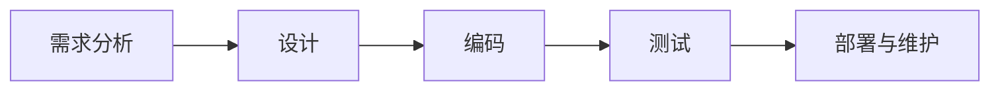
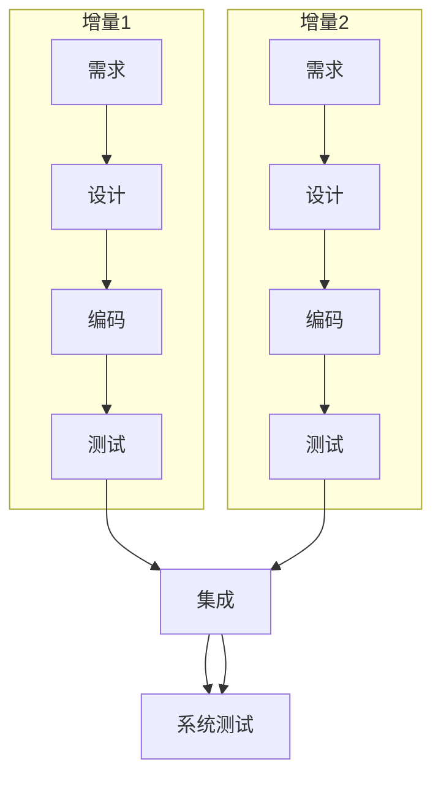
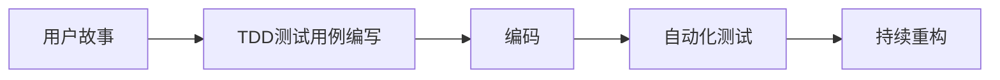
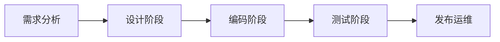

# 研发流程&测试流程

## 1. 通用软件开发阶段


## 2. 开发模型与测试应用

### 2.1 瀑布模型（Waterfall Model）
**特点**：线性顺序开发 
**流程**：
```
需求分析 → 系统设计 → 实现 → 集成测试 → 系统测试 → 维护
```
**测试应用**：

- 测试集中在开发后期
-  **V模型（测试变体）**：
  - 需求分析 ⇄ 验收测试设计
  - 系统设计 ⇄ 系统测试设计
  - 详细设计 ⇄ 集成测试设计
  - 编码 ⇄ 单元测试设计

### 2.2 快速原型模型（Rapid Prototyping）
**特点**：快速构建可演示原型 
**流程**：
```
原型设计 → 用户反馈 → 正式开发 → 测试
```
**测试应用**：
- 原型阶段：用户参与可用性测试
- 正式开发：采用瀑布/迭代模型的测试策略
- 关键价值：通过早期验证降低需求错误率

### 2.3 增量模型（Incremental Model）
**特点**：分批次交付功能模块 
**流程示例**：

**测试应用**：
-  每个增量执行完整测试周期
-  持续回归测试：新增量必须通过旧功能测试
-  集成测试是关键环节

### 2.4 螺旋模型（Spiral Model）
**特点**：风险驱动的迭代开发 
**四象限流程**：
1. 目标设定

2. 风险评估

3. 开发与测试

4. 计划下一迭代 

**测试应用**：

-  测试深度由风险分析决定
-  每轮迭代包含测试活动
-  高风险模块需强化测试（如安全测试/压力测试）

### 2.5 喷泉模型（Fountain Model）
**特点**：面向对象的迭代模型 
**测试应用**：
-  测试活动与开发阶段重叠
-  强调组件测试（类/对象级别）
-  持续进行集成测试

### 2.6 Rational统一过程（RUP）
**阶段划分**：
| 阶段         | 测试重点                 |
|--------------|--------------------------|
| 初始阶段     | 概念验证测试             |
| 细化阶段     | 架构原型测试             |
| 构建阶段     | 迭代测试（持续增加覆盖率）|
| 交付阶段     | 用户验收测试/UAT         |

**核心实践**：
-  早期制定测试计划
-  每个迭代包含测试活动
-  使用测试指标驱动迭代

### 2.7 敏捷过程与极限编程（XP）
**核心实践**：

**测试应用**：
-  **测试驱动开发（TDD）**：
  
  ```
  写测试 → 运行失败 → 写代码 → 通过测试 → 重构
  ```
-  自动化测试占比＞70%
-  持续集成：每次提交触发测试
-  结对编程：实时代码审查
-  验收测试：客户定义测试标准

### 2.8 微软过程（Microsoft Process）
**三阶段模型**：
| 阶段     | 测试活动              |
| -------- | --------------------- |
| 计划阶段 | 制定测试策略/用例设计 |
| 开发阶段 | 每日构建+冒烟测试     |
| 稳定阶段 | 重点测试+BUG 分类修复 |

**特色实践**：
-  每日构建（Daily Build）强制冒烟测试
-  BUG分级机制
-  零BUG反弹（Zero Bug Bounce）原则
### 2.9 模型对比与测试策略
| 模型         | 测试介入点   | 测试频率 | 自动化需求 |
|--------------|-------------|---------|-----------|
| 瀑布模型     | 后期        | 低      | 中等      |
| 增量模型     | 每个增量    | 中高    | 高        |
| 螺旋模型     | 每轮迭代    | 高      | 依赖风险  |
| 敏捷/XP      | 持续        | 极高    | 必须      |
| 微软过程     | 每日构建    | 极高    | 必须      |


## 3. 测试的流程


### 3.1 需求分析阶段（测试左移起点）
**测试活动：**

- 参与需求评审会，识别二义性/矛盾点
- 编写可测试性需求（如：”用户登录响应时间≤1s“）
- 产出《测试范围说明书》
- 关键交付物：需求可追溯矩阵（RTM）初版

### 3.2 设计阶段（预防缺陷黄金期）
**测试活动：**

- 评审技术方案中的异常处理逻辑
- 设计测试策略文档（测试类型/工具/环境规划）
- 制定自动化测试架构方案
- 痛点案例：接口参数边界未定义导致后续用例覆盖不全

### 3.3 编码阶段（持续反馈环建立）
**测试活动：**

 ```mermaid
  graph TB
  S[开发提交代码] --> T1[自动触发单元测试]
  T1 --> T2[代码覆盖率检查]
  T2 --> T3[生成冒烟测试包]
  T3 --> T4[每日构建验证]
 ```
**测试介入点：**

- 提供单元测试用例模板给开发
- 监控代码覆盖率
- 准备测试数据（Mock 服务/数据库快照）

### 3.4 测试执行阶段（核心质量防线）
| 测试类型     | 执行主体           | 典型工具               | 输出物                  |
|--------------|--------------------|------------------------|-------------------------|
| 功能测试     | QA 工程师          | Selenium/Jmeter | 缺陷报告+复现步骤 |
| 接口测试     | 自动化测试工程师      | Postman+Newman   | API性能基线报告   |
| 兼容性测试   | 专项测试工程师       | BrowserStack  | 多平台适配清单   |
| 安全测试     | 安全工程师           | OWASP ZAP         | 漏洞扫描报告      |

### 3.5 发布与运维阶段（测试右移）
**关键活动：**

- 预发布验证：与生产环境1:1的最终回归
- 监控埋点：业务异常日志实时警告
- A/B测试验证：新功能灰度发布的数据比对
- 线上问题追溯：缺陷根本分析（RCA）报告
- 流程瓶颈与优化实践

**典型问题链：**

- 需求变更频繁 → 测试用例维护滞后 → 回归测试遗漏 → 线上缺陷逃逸
